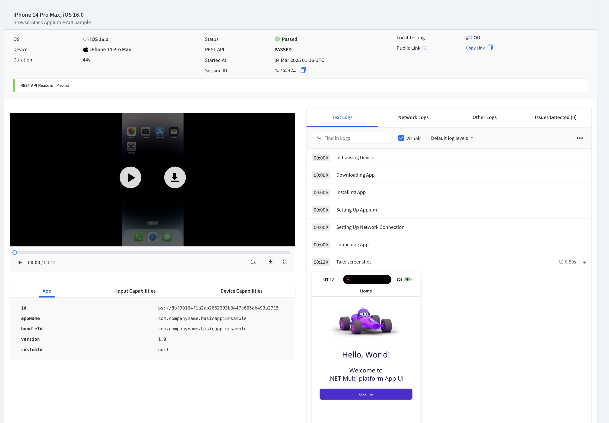

# Use BrowserStack App Automate with Appium NUnit tests for .NET MAUI Apps

Next in the series of UITesting blogs, this is a continuation of the Sample [.NET MAUI - UI testing with Appium and NUnit](https://learn.microsoft.com/en-us/samples/dotnet/maui-samples/uitest-appium-nunit/) created as part of Gerald's Blog [Getting started with UI testing .NET MAUI apps using Appium](https://devblogs.microsoft.com/dotnet/dotnet-maui-ui-testing-appium/). 

## Introduction

This repository contains a sample .NET MAUI application with UI tests using Appium and NUnit. Additionally, it integrates BrowserStack for running the tests on various devices in the cloud. This README provides a guide on setting up BrowserStack with your existing UITests and explains the GitHub Actions workflow used in this repository.

> **Note:** BrowserStack only supports .NET 8 at the moment. Therefore, the sample does not use .NET 9.
[BrowerserStack App Automate Appium + NUnit Prerequisite](https://www.browserstack.com/docs/app-automate/appium/getting-started/c-sharp/nunit/integrate-your-tests#prerequisites)

> **Note:** BrowserStack App Automate Device Cloud supports only iOS and Android Devices at the moment, so that is the focus of this blog.
[BrowerserStack App Automate Device List](https://www.browserstack.com/list-of-browsers-and-platforms/app_automate)


## Steps to Add BrowserStack to Existing UITests

1. **Sign Up for BrowserStack**:
   - Create an account on [BrowserStack](https://www.browserstack.com/).

2. **Create BrowserStack Credentials**:
   - Obtain your `BROWSERSTACK_USERNAME` and `BROWSERSTACK_ACCESS_KEY` from the BrowserStack account settings.

3. **Store Credentials as GitHub Secrets**:
   - Go to your GitHub repository.
   - Navigate to `Settings` > `Secrets` > `Actions`.
   - Add two new secrets: `BROWSERSTACK_USERNAME` and `BROWSERSTACK_ACCESS_KEY`.

4. **BrowserStack Configuration Files**:
   - The repository includes BrowserStack configuration files for both Android and iOS projects. These files define the specific settings and capabilities required to run the tests on BrowserStack.

### Android and iOS BrowserStack Configuration

The `browserstack.yml` file for the Android project can be found at `BasicAppiumNunitSample/UITests.Android/browserstack.yml` and
The `browserstack.yml` file for the iOS project can be found at `BasicAppiumNunitSample/UITests.iOS/browserstack.yml`. 

A few key parts of this configuration file are : 

- **userName & accessKey**: These are your BrowserStack credentials. They can be hardcoded or set as environment variables.
- **automationName**: Specifies the automation engine to be used. For iOS, `XCUITest` is commonly used and for Android `UIAutomator2` is commonly used.
- **appiumVersion**: Specifies the version of Appium to use.
- **app**: Path to the iOS app (IPA) or Android app (APK) to be tested. For .NET MAUI Apps, if the app is built part of the DevOps pipeline, you can add the path to the publish folder here. 
- **browserstackLocal**: Set to `false` to run on BrowserStack App Automate Service, which runs the tests on the selected Devices on the Device Cloud.

BrowserStack also has a really great [Capability Generator Tool](https://www.browserstack.com/docs/app-automate/capabilities) that walks through generating this `browerstack.yml` and you can copy paste the generated file from the tool into your repo. 


>For more details on configuring BrowserStack for Android and iOS for Appium + NUnit Tests, refer to the [BrowserStack Documentation](https://www.browserstack.com/docs/app-automate/appium/getting-started/c-sharp/nunit/integrate-your-tests).


5. **Update UITests to Use BrowserStack**:
   - To the respective `UITests.Android` and `UITests.iOS` folder, add the `browserstack.yml` files generated from Step 4. 

   > You will require separate `browserstack.yml` files for each platform. 

5. **Run BrowserStack App Automate Tests**: 
    - Follow the informative [Documentation](https://www.browserstack.com/docs/app-automate/appium/getting-started/c-sharp/nunit/integrate-your-tests) provided by BrowserStack to run the tests from your local machine. The tests can be run from [Visual Studio](https://www.browserstack.com/docs/app-automate/appium/getting-started/c-sharp/nunit/integrate-your-tests#Visual_Studio) or for Mac users, by following the [Steps for CLI](https://www.browserstack.com/docs/app-automate/appium/getting-started/c-sharp/nunit/integrate-your-tests#CLI).

6. **Run BrowserStack App Automate Tests in GitHub Actions Workflow**:
   - Setup the GitHub Actions Workflow to run the BrowserStack App Automate Test as part of your CI/CD Automation. For Azure DevOps Pipelines, the steps can be found in the BrowserStack Documentation [here](https://www.browserstack.com/docs/app-automate/appium/integrations/azure).

## GitHub Actions Workflow

The GitHub Actions workflow file `.github/workflows/test-BSGHA.yml` is set up to run the UITests on BrowserStack for both iOS and Android platforms. For details on the steps that build the .NET MAUI App for testing, you can read this blog [Getting Started with DevOps and .NET MAUI](https://devblogs.microsoft.com/dotnet/devops-for-dotnet-maui/), this section will focus specifically on the steps for BrowserStack App Automate Tasks. 

#### Prerequisites for GitHub Actions
> You should set your BrowserStack Username and Access Key as GitHub Secrets, i.e. `BROWSERSTACK_USERNAME` and `BROWSERSTACK_ACCESS_KEY` respectively.


- **Install Appium**: Installs Appium and the `XCUITest` or `UIAutomator2` driver respectively per platform. This is needed to build the `Tests.dll` used for running the tests. 

  ```bash
  npm install -g appium

  # For Android
  appium driver install uiautomator2

  # For iOS
  appium driver install xcuitest
  ```

 - **For VM Runner Macs with Apple Silicon Chips Only**  When using a **Mac VM Runner**, we need the following extra step that installs the BrowserStack .NET tool and sets it up.
    ```bash
    dotnet tool install browserstack-sdk --version 1.16.3 --create-manifest-if-needed
    dotnet browserstack-sdk setup-dotnet --dotnet-path "." --dotnet-version "8.0.403" --yes
    ```
    [BrowserStack CLI Docs Step 3: [Only for Macs with Apple silicon] Install dotnet x64 on MacOS](https://www.browserstack.com/docs/app-automate/appium/getting-started/c-sharp/nunit/integrate-your-tests#CLI)


- **Build Appium BrowserStack Tests**: Builds the Appium tests for Android or iOS 
  ```bash
  # For Android
  dotnet build BasicAppiumNunitSample/UITests.Android/UITests.Android.csproj

  # For iOS
  dotnet build BasicAppiumNunitSample/UITests.iOS/UITests.iOS.csproj
  ```
  
  - **Run Appium BrowserStack Tests**: Runs the Appium tests on BrowserStack. For Macs with Siicon Chips, use the special installed dotnet path, for Android, use regular `dotnet`. 
  ```bash
  # For Android
  dotnet test BasicAppiumNunitSample/UITests.Android/UITests.Android.csproj

  # For iOS
  ./dotnet test BasicAppiumNunitSample/UITests.iOS/UITests.iOS.csproj
  ```


## BrowserStack Test Reports and Dashboard

When you run your tests on BrowserStack, detailed test reports are generated. These reports include information such as test execution logs, screenshots, and videos of the test runs. You can access these reports through the [BrowserStack Dashboard](https://www.browserstack.com/users/sign_in).

### BrowserStack App Automate Dashboard

The [BrowserStack App Automate Dashboard](https://www.browserstack.com/docs/app-automate/appium/set-up-tests/view-test-results) provides detailed and comprehensive overview of the text execution. Alternatively, if you need to integrate with your own custom dashboard, you can use the [REST API](https://www.browserstack.com/docs/app-automate/api-reference/appium/overview).  



Some highlights of the App Automate Test Report Includes : 

- **Session Video**: Captures the recording of the test as it happens in the session. Use this recording to go at a precise point in time when an error occurred and debug.

- **Logs tab**: Select Text Logs, Console Logs, or Screenshots tab to view detailed logs. The Logs also include Appium Logs and Network Logs! 

